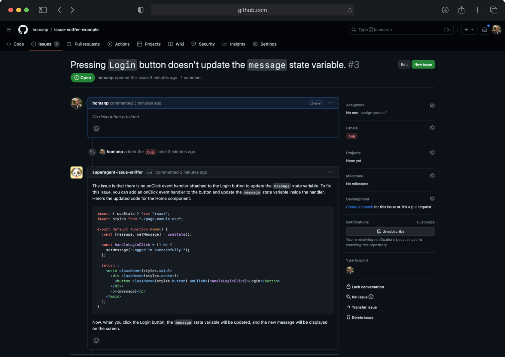

<div align="center">


# Superagent Issue Sniffer Bot

**An LLM-powered Agent that helps with debugging issues**

<p>


</p>

</div>

## What is this?

The Superagent Issue Sniffer is a Github Bot that automatically evaluates issues in your repository and adds additional context that will help you debug.



## Installation

Follow these steps to install locally:

1. Clone the repository into a public GitHub repository or fork it from [https://github.com/homanp/issue-sniffer/fork](https://github.com/homanp/issue-sniffer/fork). If you plan to distribute the code, keep the source code public.

   ```sh
   git clone https://github.com/homanp/issue-sniffer.git
   ```

2. To run the script, simply execute it using:
   ```sh
   bash setup.sh
   ```

## Roadmap

- [ ] Support updating of Pinecone index
- [ ] Support different branches (currently only supports `main`)
- [ ] Support more languages

## Contributions

Please refer to the [CONTRIBUTING.md](https://github.com/homanp/superagent/blob/main/.github/CONTRIBUTING.md) for more information on how to contribute.
